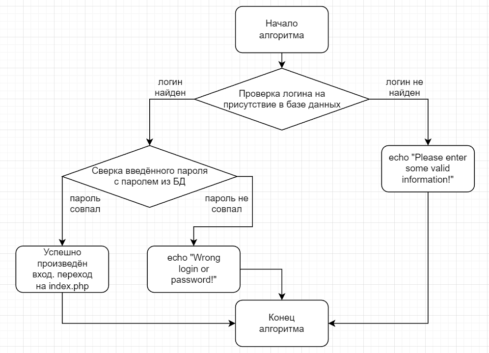

# Отчёт к лабораторной работе №1
## По курсу "Основы программирования"
[Ссылка на репозиторий на github][]

[Ссылка на репозиторий на github]: http://example.com/

## Текст задания
Цель работы - спроектировать и разработать систему авторизации пользователей на протоколе HTTP. 
Выполненные требования:
- функциональность входа/выхода, 
- хранение паролей в хешированном виде, 
- форма регистрации, 
- хранение хеша пароля с солью.
## Пользовательский интерфейс (Figma)
Необходимо создать три страницы: входа, регистрации и главную страницу сайта.
1. Страница входа

2. Страница регистрации

3. Главная страница сайта

Доступ к третьей странице невозможен не вошедшему на сайт пользователю.
## Пользовательские сценарии работы
1. Пользователь вводит в адресной строке signup.php и попадает на форму регистрации. Вводит данные, но пользователь с таким именем уже зарегистрирован - на экране появляется сообщение "Username already taken!". Тогда, при регистрации с другим ником, пользователь переходит на страницу входа и после повторного ввода данных попадает на сайт.
2. Пользователь вводит в адресной строке signin.php и попадает на форму входа. Вводит данные, но неверно - появляется сообщение "Wrong login or password!". Пользователь повторн вводит данные и успешно попадает на сайт.
3. Пользователь вводит в адресной строке index.php и оказывается перенаправлен на страницу со входом. Вводит свои верные данные и попадает на сайт.
## Описание API сервера и  его хореографии
Сервер использует HTTP GET запросы с полями user_name (логин) и password (пароль). Также, сервер использует куки auth_token - токен авторизации.
1. Алгоритм входа на сайт - отправляется запрос, который возвращает данные о пользователе с отправленным логином, если данные найдены - пароль сверяется с захешированным из базы данных и совершается вход. В ином случае на экране пользователь видит сообщение "Wrong login or password!" - неправильные логин или пароль. Если данные о пользователе с данным логином не были найдены вообще - появляется текст "Please enter some valid information!" - пожалуйста, введите достоверную информацию.
2. Алгоритм регистрации на сайте - принимаются все введённые пользователем данные, а также генерируются соль и хеш пароля, далее отправляется запрос, который проверяет, нет ли уже пользователя с таким именем в базе данных. Если пользователь оставил одно из полей логин/пароль пустым, появляется сообщение "Please enter some valid information!" - пожалуйста, введите достоверную информацию. При условии, что пользователь с подобным логином не был найден в базе данных, серверу отправляется запрос и пользователь заносится в базу данных, после чего попадает на страницу входа. Если пользователь с этим логином в базе данных есть - выскакивает сообщение "Username already taken!" - имя пользователя уже занято.
3. Функция аутентификации пользователя - по запросу серверу возвращается токен аутентификации, соответствующий пользователю с токеном, используемым в браузере. Если совпадение найдено - переход на главную страницу разрешён, в ином случае пользователь возвращается на страницу входа для повторной авторизации.

## Описание структуры базы данных
Для администрирования сервера MySQL и просмотра содержимого базы данных используется браузерное приложение phpMyAdmin. Используется 5 столбцов:
1. "id" типа int с автоматическим приращением для выдачи уникальных id каждому зарегистрированному пользователю,
2. "user_name" типа varchar для хранения логина пользователя,
3. "auth_token" типа bigint для хранения значения токена этого пользователя (значения кукис),
4. "password" типа varchar для хранения пароля пользователя в хешированном виде,
5. "salt" типа varchar для хранения соли, применяемой для хеширования пароля.

Пример того, как данные пользователей выглядят в базе данных.

## Описание алгоритмов
1. Алгоритм входа на сайт

2. Алгоритм регистрации на сайте

3. Алгоритм аутентификации пользователя

## Примеры HTTP запросов/ответов


## Значимые фрагменты кода
1. Алгоритм входа на сайт
```
if ($_SERVER['REQUEST_METHOD'] == "POST") {
    $user_name = $_POST['user_name'];
    $query = "SELECT * FROM users WHERE user_name='$user_name' limit 1";
    $result = mysqli_query($con, $query);
    $user_data = mysqli_fetch_assoc($result);

    if (!empty($user_data)) {
        $salt = $user_data['salt'];
        $hash = $user_data['password'];
        $password = md5($salt . $_POST['password']);

        if ($password == $hash) {
            setcookie('auth_token', $user_data['auth_token'], time() +  60 * 60 * 24);
            header("Location: index.php");
            die;
        } else {
            echo "Wrong login or password!";
        }
    } else {
        echo "Please enter some valid information!";
    }
}
```
2. Алгоритм регистрации на сайте
```
if ($_SERVER['REQUEST_METHOD'] == "POST") {
    $auth_token = $_COOKIE['auth_token'];
    $user_name = $_POST['user_name'];
    $salt = random_salt();
    $password = md5($salt . $_POST['password']);
    if (!empty($user_name) && !empty($password)) {
        $query = "SELECT * FROM users WHERE user_name='$user_name'";
        $result = mysqli_query($con, $query);
    } else {
        header("Location: signup.php");
        echo "Please enter some valid information!";
    }

    if (mysqli_num_rows($result) == 0) {
        $auth_token = $_COOKIE['auth_token'];
        $query = "INSERT into users (user_name, auth_token, password, salt) VALUES ('$user_name', '$auth_token', '$password', '$salt')";
        $result = mysqli_query($con, $query);

        header("Location: signin.php");
        die;
    } else {
        echo "Username already taken!";
    }
}
```
3. Функция аунтентификации пользователя
```
function checkAuth(): bool 
{
    require("connection.php");
    $user_token = $_COOKIE['auth_token'];
    
    $query = "SELECT * FROM users WHERE auth_token='$user_token' limit 1";
    $result = mysqli_query($con, $query);
    $user_data = mysqli_fetch_assoc($result);
    
    if ($_COOKIE['auth_token'] != $user_data['auth_token']) {
        return false;
    }
    else {
        return true;
    }
}
```